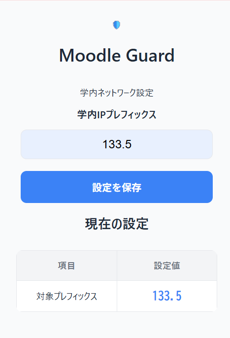
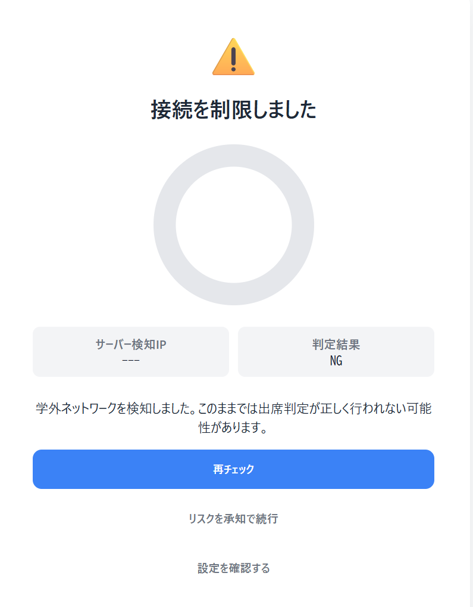

# Moodle出席ミスチェッカー
# 概要
大学システムMoodleのコース内の出席システムでは、学内WiFiにつないだ状態でコースにアクセスしないと出席として認められないことが多いです。

Moodleで出席登録を行う際、
- スマートホン端末からキャリア通信でアクセスしてしまった
- テザリング先のIPで登録されてしまった
- VPNを利用しており、VPNサーバー側のIPで登録されてしまった

といった経験はないでしょうか？  
このChome拡張機能は、**学内IPからアクセスできているのかをチェックし、出席登録が失敗しそうな場合は警告を表示・アクセスをブロックしてくれます**

